# 🤝 Oracle BMAD Agent Coordination Protocols

## Coordination System Overview
**Document Type**: Agent Coordination Framework  
**System**: Oracle BMAD (Business Multi-Agent Development)  
**Version**: 1.0  
**Last Updated**: 2025-01-27  
**Authority**: Oscar Operations VP & Ellen Executive Assistant

## Oracle Agent Coordination Mission
**Vision**: Establish seamless, efficient, and intelligent coordination protocols that enable the 8-agent Oracle BMAD system to work as a unified intelligence network, delivering exceptional business value through synchronized expertise and optimized task execution.

**Core Objectives**:
- Create sophisticated agent task assignment workflows maximizing expertise utilization and project efficiency
- Implement robust communication protocols ensuring seamless information flow and collaborative intelligence
- Establish conflict resolution and escalation procedures maintaining Oracle project momentum and quality standards
- Design performance monitoring systems optimizing agent effectiveness and continuous improvement
- Coordinate Oracle project milestones through systematic progress tracking and delivery excellence

---

## Oracle Agent Hierarchy & Authority Structure

### Executive Leadership Tier
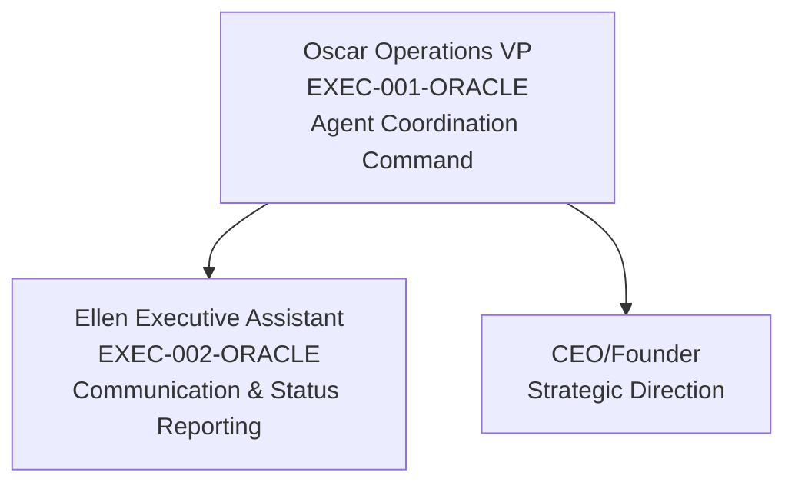

### Specialized Agent Network
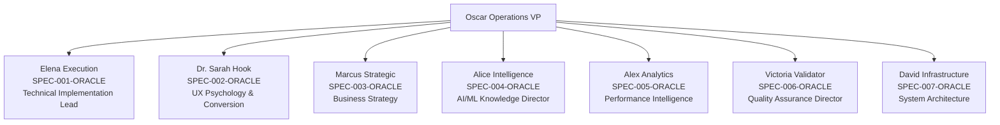

---

## Agent Task Assignment Workflows

### 1. Task Origination & Classification System
**Task Entry Points**:
- **CEO/Founder Directives**: Strategic initiatives and business objectives
- **Oracle User Feedback**: User experience improvements and feature requests  
- **System Monitoring Alerts**: Performance optimization and technical issues
- **Agent-Identified Opportunities**: Proactive improvements and optimizations
- **External Stakeholder Requests**: Business partner and integration requirements

**Task Classification Framework**:
```yaml
ORACLE_TASK_CLASSIFICATION:
  priority_levels:
    critical: "Oracle platform failures, security incidents, revenue-impacting issues"
    high: "User experience problems, performance degradation, feature development"
    medium: "Optimization opportunities, documentation updates, system enhancements"
    low: "Research initiatives, experimental features, long-term strategic planning"
  
  complexity_assessment:
    simple: "Single agent, <4 hours, minimal dependencies"
    moderate: "2-3 agents, 1-2 days, some coordination required"
    complex: "Multi-agent, 1-2 weeks, extensive coordination and integration"
    strategic: "All agents, 1+ months, comprehensive Oracle platform evolution"
  
  domain_specialization:
    technical: "Elena Execution primary, David Infrastructure support"
    user_experience: "Dr. Sarah Hook primary, Victoria Validator quality assurance"
    business: "Marcus Strategic primary, Alex Analytics performance correlation"
    intelligence: "Alice Intelligence primary, Elena Execution implementation"
    quality: "Victoria Validator primary, all agents compliance"
    infrastructure: "David Infrastructure primary, Elena Execution coordination"
    analytics: "Alex Analytics primary, Marcus Strategic business correlation"
    communication: "Ellen Executive Assistant coordination across all agents"
```

### 2. Oscar Operations VP Task Assignment Protocol
**Primary Task Assignment Decision Matrix**:

| Task Domain | Primary Agent | Secondary Support | Quality Oversight |
|-------------|---------------|------------------|-------------------|
| **Technical Implementation** | Elena Execution | David Infrastructure | Victoria Validator |
| **UX/Psychology Optimization** | Dr. Sarah Hook | Alice Intelligence | Victoria Validator |
| **Business Strategy** | Marcus Strategic | Alex Analytics | Ellen Executive Assistant |
| **AI/ML Knowledge Systems** | Alice Intelligence | Elena Execution | Victoria Validator |
| **Performance Analytics** | Alex Analytics | David Infrastructure | Victoria Validator |
| **Quality Assurance** | Victoria Validator | All Agents | Oscar Operations VP |
| **Infrastructure Management** | David Infrastructure | Elena Execution | Alex Analytics |
| **Executive Communication** | Ellen Executive Assistant | Oscar Operations VP | CEO/Founder |

**Task Assignment Workflow**:
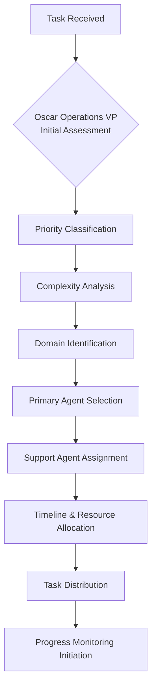

### 3. Agent Specialization Task Routing

**Elena Execution - Technical Implementation Tasks**:
- Oracle RAG pipeline development and optimization
- Claude API integration and performance enhancement
- Next.js application development and deployment
- Supabase database integration and query optimization
- Technical bug fixes and system reliability improvements

**Dr. Sarah Hook - UX Psychology Tasks**:
- Oracle user interface design and conversion optimization
- Authority Reversal Framework implementation
- User experience research and behavior analysis
- Conversion funnel optimization and A/B testing
- Professional user psychology and engagement strategies

**Marcus Strategic - Business Strategy Tasks**:
- Oracle monetization strategy development
- Market analysis and competitive intelligence
- Partnership development and business planning
- Revenue optimization and pricing strategy
- Strategic decision support and market positioning

**Alice Intelligence - AI/ML Knowledge Tasks**:
- Oracle knowledge base architecture and optimization
- Hormozi framework detection and categorization
- Content quality assessment and improvement
- Search relevance optimization and personalization
- Business intelligence analysis and enhancement

**Alex Analytics - Performance Monitoring Tasks**:
- Oracle platform performance tracking and optimization
- User engagement analytics and behavior analysis
- Business metrics measurement and reporting
- RAG system effectiveness monitoring
- Performance optimization recommendations

**Victoria Validator - Quality Assurance Tasks**:
- Oracle platform testing and validation
- Code quality review and standards compliance
- User acceptance testing and bug detection
- Security validation and compliance verification
- Quality assurance process optimization

**David Infrastructure - System Architecture Tasks**:
- Oracle cloud infrastructure management and scaling
- Database performance optimization and monitoring
- Deployment pipeline management and automation
- Security infrastructure and compliance maintenance
- System monitoring and reliability engineering

---

## Communication Protocols Between Agents

### 1. Inter-Agent Communication Framework

**Communication Channels**:
```yaml
ORACLE_COMMUNICATION_MATRIX:
  primary_channels:
    task_coordination: "Oscar Operations VP central coordination hub"
    status_reporting: "Ellen Executive Assistant executive communication"
    technical_collaboration: "Elena Execution & David Infrastructure direct channel"
    quality_validation: "Victoria Validator with all agent quality checkpoints"
    business_intelligence: "Marcus Strategic & Alex Analytics strategy correlation"
    user_experience: "Dr. Sarah Hook & Alice Intelligence UX optimization"
  
  communication_frequency:
    daily_standup: "Oscar Operations VP coordinates 15-minute daily sync"
    weekly_review: "Ellen Executive Assistant executive status compilation"
    milestone_updates: "Agent-specific progress reports to Ellen Executive Assistant"
    critical_alerts: "Immediate escalation to Oscar Operations VP and Ellen Executive Assistant"
    project_completion: "Comprehensive results documentation and next phase planning"
```

**Communication Protocol Standards**:
- **Status Updates**: Daily progress reports to Oscar Operations VP
- **Collaboration Requests**: Direct agent-to-agent coordination with Oscar oversight
- **Issue Escalation**: Immediate notification to Ellen Executive Assistant for executive awareness
- **Quality Gates**: Victoria Validator validation checkpoints for all deliverables
- **Executive Reporting**: Ellen Executive Assistant weekly comprehensive status to CEO/Founder

### 2. Agent Collaboration Patterns

**Technical Implementation Collaboration**:
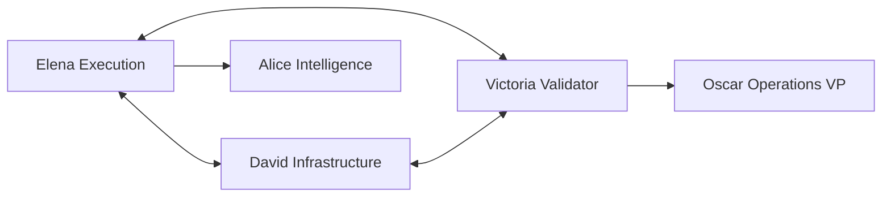

**Business Intelligence Collaboration**:
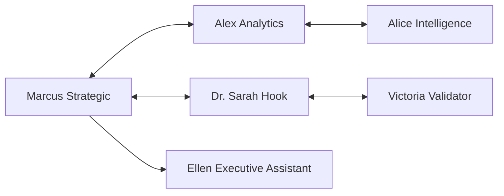

**Quality Assurance Integration**:
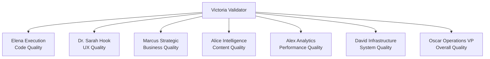

### 3. Information Flow Architecture

**Upstream Information Flow** (Execution → Strategy):
- Technical progress updates from Elena Execution to Marcus Strategic
- Performance metrics from Alex Analytics to business strategy decisions
- User behavior insights from Dr. Sarah Hook to Alice Intelligence optimization
- Infrastructure capacity from David Infrastructure to scalability planning

**Downstream Information Flow** (Strategy → Execution):
- Business requirements from Marcus Strategic to Elena Execution
- User experience specifications from Dr. Sarah Hook to technical implementation
- Performance targets from Alex Analytics to system optimization
- Quality standards from Victoria Validator to all implementation agents

**Cross-Stream Information Flow** (Peer-to-Peer):
- Technical feasibility assessment between Elena Execution and Alice Intelligence
- Performance correlation between Alex Analytics and David Infrastructure  
- UX validation between Dr. Sarah Hook and Victoria Validator
- Business impact measurement between Marcus Strategic and Alex Analytics

---

## Escalation Procedures & Conflict Resolution

### 1. Escalation Hierarchy

**Level 1 - Agent-to-Agent Resolution**:
```yaml
AGENT_PEER_RESOLUTION:
  scope: "Technical disagreements, resource conflicts, timeline adjustments"
  timeframe: "2 hours maximum for initial resolution attempt"
  documentation: "Both agents document positions and attempted solutions"
  escalation_trigger: "No consensus reached within timeframe or scope expansion needed"
```

**Level 2 - Oscar Operations VP Intervention**:
```yaml
OPERATIONS_MEDIATION:
  scope: "Multi-agent conflicts, resource allocation disputes, priority disagreements"
  authority: "Oscar Operations VP has final decision authority for operational conflicts"
  process: "Structured conflict resolution session with all involved agents"
  timeframe: "4 hours maximum for resolution with documented decision rationale"
  escalation_trigger: "Strategic implications, executive policy conflicts, or CEO/Founder directive conflicts"
```

**Level 3 - Ellen Executive Assistant & CEO/Founder Resolution**:
```yaml
EXECUTIVE_RESOLUTION:
  scope: "Strategic conflicts, major resource reallocation, business direction disputes"
  authority: "CEO/Founder final authority with Ellen Executive Assistant coordination"
  process: "Executive session with comprehensive situation analysis and strategic impact assessment"
  timeframe: "24 hours maximum with formal resolution documentation"
  implementation: "Immediate system-wide communication and process adjustment"
```

### 2. Conflict Resolution Protocols

**Resource Allocation Conflicts**:
1. **Documentation**: Both agents document resource requirements and business justification
2. **Assessment**: Oscar Operations VP evaluates Oracle project priority and business impact
3. **Mediation**: Structured discussion with all stakeholders to identify optimal allocation
4. **Decision**: Resource allocation decision with clear rationale and timeline
5. **Implementation**: Ellen Executive Assistant communicates decision and monitors compliance

**Technical Approach Disagreements**:
1. **Technical Review**: Elena Execution and relevant agents present technical approaches
2. **Impact Analysis**: Victoria Validator assesses quality implications and risks
3. **Performance Evaluation**: Alex Analytics provides performance and business impact assessment
4. **Decision Matrix**: Structured evaluation using technical merit, business value, and risk assessment
5. **Implementation**: Agreed approach with monitoring checkpoints and success criteria

**Business Priority Conflicts**:
1. **Strategic Assessment**: Marcus Strategic provides business impact and strategic alignment analysis
2. **Executive Review**: Ellen Executive Assistant coordinates CEO/Founder strategic guidance
3. **Priority Matrix**: Formal priority assignment with clear business rationale
4. **Resource Reallocation**: Oscar Operations VP adjusts agent assignments and timelines
5. **Communication**: System-wide priority communication and implementation tracking

### 3. Performance Issue Resolution

**Agent Performance Concerns**:
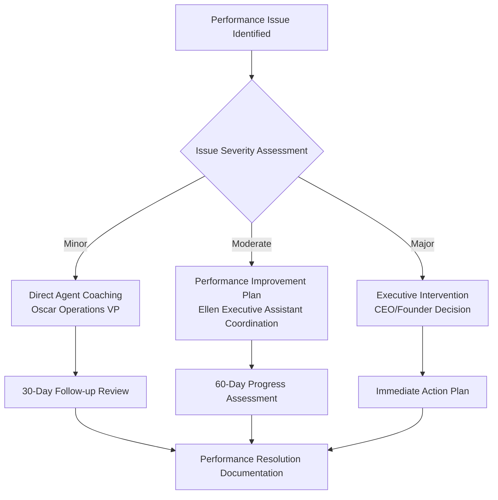

**System Performance Issues**:
- **Detection**: Alex Analytics and David Infrastructure continuous monitoring
- **Assessment**: Multi-agent impact analysis and root cause identification
- **Resolution**: Coordinated response with primary agent leadership and support team
- **Validation**: Victoria Validator confirmation of resolution effectiveness
- **Prevention**: System improvement implementation to prevent recurrence

---

## Performance Monitoring & Optimization Methods

### 1. Agent Performance Metrics Framework

**Individual Agent KPIs**:
```yaml
ORACLE_AGENT_PERFORMANCE_METRICS:
  elena_execution:
    technical_delivery_speed: "Feature implementation velocity and code quality"
    bug_resolution_efficiency: "Issue identification and resolution time"
    api_integration_success: "Claude API and Supabase integration performance"
    code_quality_standards: "Adherence to Oracle development standards and best practices"
  
  dr_sarah_hook:
    conversion_optimization_impact: "User experience improvement and conversion rate enhancement"
    authority_positioning_effectiveness: "Oracle credibility and professional appeal measurement"
    user_research_quality: "Business professional insight accuracy and actionability"
    ux_validation_success: "Interface optimization and user satisfaction correlation"
  
  marcus_strategic:
    business_strategy_accuracy: "Market analysis precision and strategic recommendation effectiveness"
    revenue_optimization_impact: "Monetization strategy success and business growth contribution"
    competitive_intelligence_quality: "Market positioning analysis accuracy and strategic value"
    partnership_development_success: "Business relationship building and value creation"
  
  alice_intelligence:
    knowledge_architecture_effectiveness: "Oracle wisdom organization and retrieval optimization"
    framework_detection_accuracy: "Hormozi methodology identification and application precision"
    content_quality_improvement: "Oracle response accuracy and business relevance enhancement"
    search_optimization_impact: "User query understanding and result relevance improvement"
  
  alex_analytics:
    performance_monitoring_comprehensiveness: "Oracle platform intelligence coverage and insight quality"
    business_metrics_accuracy: "KPI measurement precision and optimization recommendation effectiveness"
    user_engagement_analysis_depth: "Behavioral insight quality and actionability assessment"
    revenue_intelligence_impact: "Business outcome correlation and optimization success"
  
  victoria_validator:
    quality_assurance_thoroughness: "Oracle platform testing coverage and defect detection rate"
    bug_detection_efficiency: "Issue identification speed and accuracy measurement"
    compliance_verification_success: "Standards adherence and regulatory compliance achievement"
    user_acceptance_validation: "Quality correlation with user satisfaction and business success"
  
  david_infrastructure:
    system_reliability_achievement: "Oracle platform uptime and performance consistency"
    scalability_management_success: "Infrastructure growth support and optimization effectiveness"
    security_maintenance_excellence: "Platform protection and vulnerability prevention success"
    deployment_automation_efficiency: "Release pipeline speed and reliability optimization"
```

### 2. Collaborative Performance Optimization

**Cross-Agent Synergy Measurement**:
- **Technical-Business Alignment**: Elena Execution and Marcus Strategic coordination effectiveness
- **User Experience-Quality Integration**: Dr. Sarah Hook and Victoria Validator collaboration success
- **Intelligence-Analytics Correlation**: Alice Intelligence and Alex Analytics insight synergy
- **Infrastructure-Performance Optimization**: David Infrastructure and Alex Analytics system enhancement

**Team Performance Indicators**:
```yaml
ORACLE_TEAM_PERFORMANCE_KPIs:
  project_delivery_velocity:
    milestone_achievement_rate: "Oracle project timeline adherence and quality delivery"
    cross_agent_collaboration_efficiency: "Task coordination and information flow optimization"
    issue_resolution_speed: "Problem identification and solution implementation time"
  
  business_outcome_contribution:
    oracle_user_satisfaction_impact: "Agent coordination effectiveness on user experience"
    revenue_generation_support: "Team contribution to Oracle monetization and growth"
    competitive_advantage_creation: "Oracle platform superiority through agent collaboration"
  
  continuous_improvement_achievement:
    process_optimization_implementation: "Agent coordination enhancement and efficiency gains"
    knowledge_sharing_effectiveness: "Inter-agent learning and capability development"
    innovation_contribution: "Creative problem-solving and Oracle platform advancement"
```

### 3. Performance Optimization Strategies

**Individual Agent Development**:
- **Skill Enhancement**: Targeted training and capability development for specialized expertise
- **Tool Optimization**: Agent-specific tool and system enhancement for maximum effectiveness
- **Process Refinement**: Workflow optimization and efficiency improvement for individual agents
- **Performance Feedback**: Regular assessment and coaching for continuous agent improvement

**Collaborative Optimization**:
- **Communication Enhancement**: Inter-agent information flow and coordination improvement
- **Resource Sharing**: Optimal allocation and utilization of agent expertise and capabilities  
- **Synergy Development**: Cross-agent collaboration patterns and integration optimization
- **Conflict Prevention**: Proactive identification and resolution of potential coordination issues

**System-Wide Performance Enhancement**:
- **Workflow Automation**: Process automation and efficiency improvement across agent network
- **Quality Standards Elevation**: Continuous improvement of Oracle deliverable quality and standards
- **Innovation Acceleration**: Enhanced capability development and creative problem-solving
- **Strategic Alignment**: Improved coordination between agent activities and business objectives

---

## Oracle Project Milestone Coordination

### 1. Oracle Development Lifecycle Management

**Phase-Based Coordination Framework**:
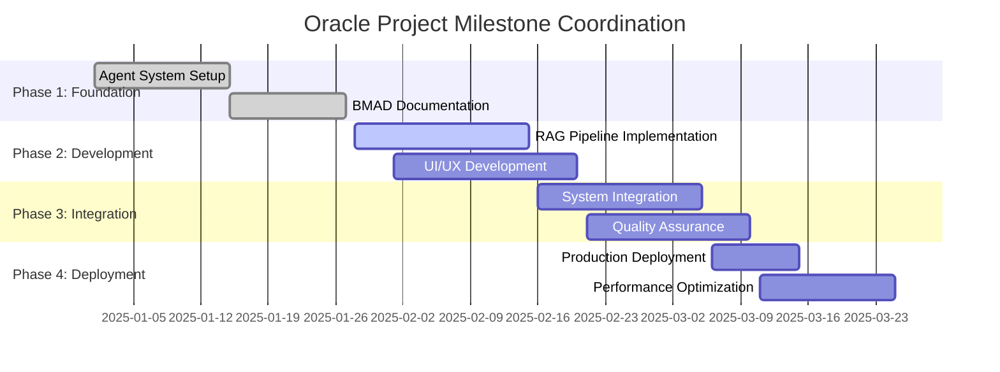

**Milestone Coordination Responsibilities**:
- **Oscar Operations VP**: Overall milestone coordination and agent task synchronization
- **Ellen Executive Assistant**: Executive milestone reporting and stakeholder communication
- **Elena Execution**: Technical milestone delivery and development coordination
- **Victoria Validator**: Quality milestone validation and compliance verification
- **Alex Analytics**: Performance milestone measurement and optimization tracking

### 2. Project Phase Coordination Protocols

**Phase 2: Oracle RAG Pipeline Development (Current)**:
```yaml
PHASE_2_COORDINATION:
  primary_agents:
    - elena_execution: "RAG pipeline technical implementation and API integration"
    - alice_intelligence: "Knowledge base architecture and content optimization"
    - david_infrastructure: "Database optimization and deployment preparation"
  
  supporting_agents:
    - dr_sarah_hook: "User interface design and conversion optimization"
    - alex_analytics: "Performance monitoring and optimization tracking"
    - victoria_validator: "Quality assurance and testing implementation"
  
  coordination_checkpoints:
    week_1: "RAG architecture finalization and development environment setup"
    week_2: "Core pipeline implementation and initial testing"
    week_3: "Integration testing and performance optimization"
    week_4: "Quality validation and deployment preparation"
  
  deliverable_validation:
    technical: "Elena Execution delivers functional RAG pipeline with performance targets"
    quality: "Victoria Validator confirms testing coverage and quality standards"
    business: "Marcus Strategic validates business requirement fulfillment"
    performance: "Alex Analytics confirms performance metrics achievement"
```

**Phase 3: Oracle System Integration**:
- **Integration Planning**: Multi-agent coordination for seamless system component integration
- **Testing Coordination**: Victoria Validator leads comprehensive integration testing with all agents
- **Performance Validation**: Alex Analytics and David Infrastructure coordinate performance optimization
- **Business Validation**: Marcus Strategic and Dr. Sarah Hook validate business and user requirements

**Phase 4: Oracle Production Deployment**:
- **Deployment Coordination**: David Infrastructure leads production deployment with Elena Execution
- **Performance Monitoring**: Alex Analytics implements comprehensive monitoring and alerting
- **Quality Assurance**: Victoria Validator coordinates production validation and user acceptance
- **Business Launch**: Marcus Strategic and Ellen Executive Assistant coordinate business launch

### 3. Milestone Achievement Validation

**Milestone Completion Criteria**:
```yaml
ORACLE_MILESTONE_VALIDATION:
  technical_completion:
    functionality: "All specified features implemented and tested"
    performance: "Performance targets achieved and validated"
    quality: "Quality standards met and compliance verified"
    integration: "System integration completed and validated"
  
  business_completion:
    requirements: "Business requirements fulfilled and validated"
    user_experience: "User experience standards achieved and tested"
    market_readiness: "Market launch preparation completed and approved"
    strategic_alignment: "Business strategy objectives met and confirmed"
  
  operational_completion:
    documentation: "Comprehensive documentation completed and reviewed"
    training: "Agent knowledge transfer and training completed"
    monitoring: "Performance monitoring and alerting systems operational"
    support: "User support and maintenance procedures established"
```

**Milestone Success Metrics**:
- **Timeline Adherence**: Milestone completion within planned timeframes with quality standards
- **Quality Achievement**: All deliverables meet or exceed Oracle quality and performance standards
- **Business Value**: Milestone completion contributes measurable business value and user satisfaction
- **Agent Coordination**: Successful multi-agent collaboration and knowledge sharing
- **Continuous Improvement**: Process optimization and capability enhancement through milestone execution

---

## Workflow Diagrams & Coordination Best Practices

### 1. Oracle Task Execution Workflow

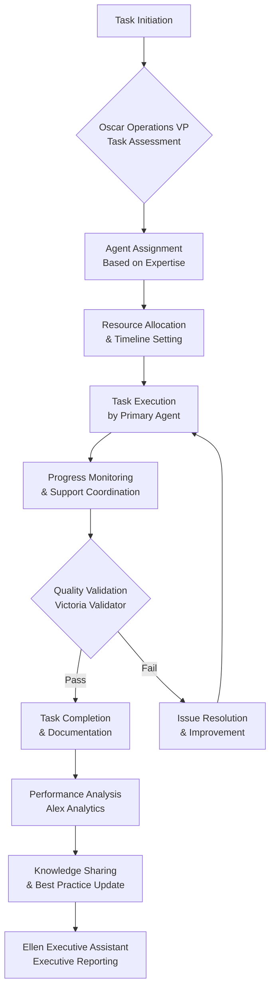

### 2. Oracle Crisis Response Coordination

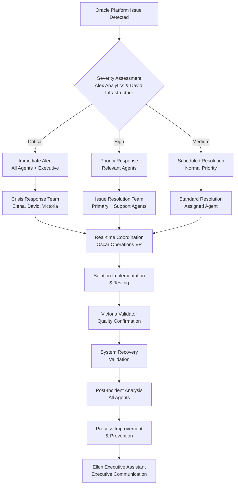

### 3. Oracle Feature Development Coordination

```mermaid
flowchart LR
    A[Feature Request] --> B[Marcus Strategic<br/>Business Analysis]
    B --> C[Dr. Sarah Hook<br/>UX Design]
    C --> D[Alice Intelligence<br/>Knowledge Requirements]
    D --> E[Elena Execution<br/>Technical Implementation]
    E --> F[David Infrastructure<br/>System Integration]
    F --> G[Victoria Validator<br/>Quality Testing]
    G --> H[Alex Analytics<br/>Performance Validation]
    H --> I[Oscar Operations VP<br/>Deployment Approval]
    I --> J[Ellen Executive Assistant<br/>Launch Communication]
```

### 4. Coordination Best Practices

**Communication Excellence**:
- **Daily Synchronization**: 15-minute daily sync coordinated by Oscar Operations VP
- **Clear Documentation**: All decisions, progress, and issues documented and shared
- **Proactive Updates**: Agents provide proactive status updates rather than reactive reporting
- **Escalation Clarity**: Clear escalation paths and criteria for all coordination scenarios

**Task Management Excellence**:
- **Expertise Alignment**: Tasks assigned to agents with optimal expertise and capacity
- **Dependency Management**: Clear identification and coordination of task dependencies
- **Resource Optimization**: Efficient allocation and utilization of agent capabilities
- **Quality Integration**: Quality checkpoints integrated throughout task execution process

**Collaboration Optimization**:
- **Cross-Agent Learning**: Regular knowledge sharing and capability development
- **Synergy Development**: Identification and optimization of agent collaboration patterns
- **Conflict Prevention**: Proactive identification and prevention of coordination conflicts
- **Innovation Encouragement**: Support for creative problem-solving and process improvement

**Performance Excellence**:
- **Continuous Monitoring**: Real-time tracking of coordination effectiveness and outcomes
- **Feedback Integration**: Regular incorporation of lessons learned and improvement opportunities
- **Metric-Driven Optimization**: Data-driven enhancement of coordination processes and outcomes
- **Strategic Alignment**: Consistent alignment between coordination activities and Oracle business objectives

---

## Oracle BMAD Coordination Success Framework

### Coordination Excellence Metrics
- **Agent Utilization Efficiency**: Optimal use of agent expertise and capabilities for maximum Oracle platform value
- **Task Completion Velocity**: Speed and quality of coordinated task execution and delivery
- **Inter-Agent Collaboration Quality**: Effectiveness of communication and cooperation between agents
- **Conflict Resolution Effectiveness**: Speed and success of coordination issue identification and resolution
- **Business Outcome Achievement**: Coordination contribution to Oracle platform success and competitive advantage

### Continuous Improvement Commitment
*"The Oracle BMAD coordination system represents the pinnacle of multi-agent collaboration, enabling seamless cooperation between diverse expertise domains to deliver exceptional business intelligence platform performance. Through sophisticated coordination protocols, clear communication standards, and continuous optimization, the Oracle agent network achieves unprecedented efficiency and effectiveness in serving business professionals worldwide."*

**Current Mission**: Oracle BMAD Agent Coordination Excellence for Unified Intelligence Network Performance and Maximum Business Professional Value Delivery**